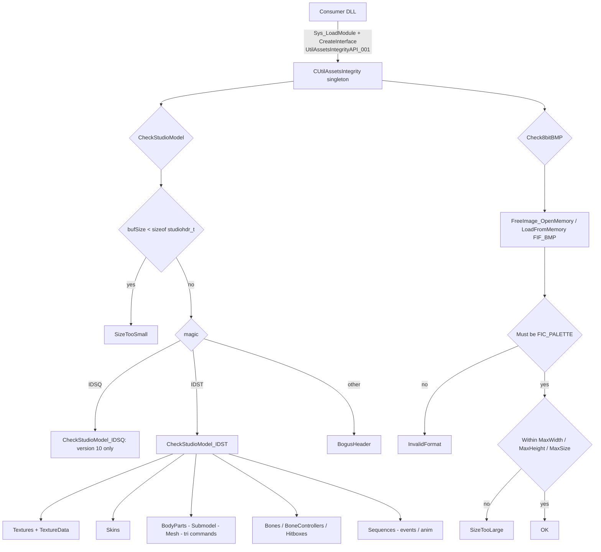

# UtilAssetsIntegrity

UtilAssetsIntegrity is a standalone utility DLL (`UtilAssetsIntegrity.dll`) that performs basic
integrity and bounds validation on untrusted binary assets through the `IUtilAssetsIntegrity`
interface, so malformed data does not cause out-of-bounds reads/writes or crashes in the upper layers
that parse, render or load it. It covers two resource types: GoldSrc/HL1 StudioModel assets
(`IDST` main models and `IDSQ` sequence groups) and 8-bit indexed-color BMP images.

The migration preserves the source implementation and the ABI; it does **not** expand the original
validation guarantees. The DLL is a compatibility-preserving asset filter, and its smoke tests cover
the public contract and runtime integration rather than proving complete malformed-input safety.

## Provenance

This repository is the standalone UtilAssetsIntegrity library, extracted from MetaHookSv
(`PluginLibs/UtilAssetsIntegrity/`) into its own CMake workspace, aligned with the standalone
Renderer, PrecacheManager and HeapPatch projects. The standalone module note this repository used to
carry (`memory/UtilAssetsIntegrity.md`, itself adapted from MetaHookSv
`memory/UtilAssetsIntegrity.md`, a source-level analysis) has been merged into this note and removed;
this is now the single knowledge entry point for the repository, and its architecture, public
contract, validation boundaries and verification content all live here, after being checked against
the current `src/` and `include/Interface/`.

The implementation files, the public header and the MIT license are byte-for-byte identical to the
original MetaHookSv copies; the only change is the build system (CMake instead of MSBuild). The
`metahooksv` Basic Memory project belongs to the source repository; notes here use the
`utilassetsintegrity` project and the `utilassetsintegrity/` permalink prefix.

## Responsibilities and entry points

- `src/UtilAssetsIntegrity.cpp`: `CUtilAssetsIntegrity : public IUtilAssetsIntegrity` — the whole
  implementation (`CheckStudioModel`, `Check8bitBMP` and the per-block validators), plus the
  singleton registration that `EXPOSE_SINGLE_INTERFACE` publishes at the end of the file.
- `src/dllmain.cpp`: no-op DLL entry point.
- `include/Interface/IUtilAssetsIntegrity.h`: the public contract —
  `UTIL_ASSETS_INTEGRITY_INTERFACE_VERSION` (`"UtilAssetsIntegrityAPI_001"`),
  `UtilAssetsIntegrityCheckReason`
  (`OK` / `Unknown` / `InvalidFormat` / `SizeTooLarge` / `SizeTooSmall` / `BogusHeader` /
  `VersionMismatch` / `OutOfBound`), `UtilAssetsIntegrityCheckResult` (`ReasonStr[256]`) and
  `UtilAssetsIntegrityCheckResult_BMP` (adds `size_t` `MaxWidth` / `MaxHeight` / `MaxSize`,
  initialized to zero).
- `tests/SmokeTests.cpp`: a DLL-integration smoke test that loads the real module, obtains its
  factory and exercises the public behavior.

`EXPOSE_SINGLE_INTERFACE` registers a DLL-owned `CUtilAssetsIntegrity` singleton under
`UtilAssetsIntegrityAPI_001`. Callers load the DLL, resolve `CreateInterface` and request that
version; the returned pointer stays valid only while the DLL is loaded, and the instance must not be
deleted.

## Public contract and data flow

`CheckStudioModel(buf, bufSize, result)`:

- The entry point requires `bufSize >= sizeof(studiohdr_t)`, **including for `IDSQ`**; anything
  smaller returns `SizeTooSmall`.
- It dispatches on the first four bytes: `IDSQ` → `CheckStudioModel_IDSQ`, `IDST` →
  `CheckStudioModel_IDST`, anything else `BogusHeader` (with the four bytes echoed into `ReasonStr`).
- `CheckStudioModel_IDSQ` only requires `version == 10`; otherwise `VersionMismatch`. It keeps the
  original minimal check, so a sequence group is accepted as soon as its header is valid.
- `CheckStudioModel_IDST` distinguishes the "system-memory" segment (`texturedataindex` when
  `textureindex != 0`, otherwise `length`) from the whole file (`bufSize`), then runs the pipeline and
  returns the first failure: texture table and texture pixel data, skin references, body parts
  (recursing into submodels, meshes and tri commands), bones, sequences (recursing into events and
  anim data), hitboxes and bone controllers. Structures that must live in the model-main segment are
  ranged against the system-memory boundary, while texture pixel data may reach the end of the file.

`Check8bitBMP(buf, bufSize, result)`:

- Opens a FreeImage memory stream (`FreeImage_OpenMemory`; failure → `Unknown`) and decodes
  `FIF_BMP` (`FreeImage_LoadFromMemory`; failure → `BogusHeader`). Both handles are released through
  `SCOPE_EXIT`, so every early return cleans up.
- Requires the `FIC_PALETTE` (indexed-color) classification; anything else is `InvalidFormat`. The
  method name does not add a separate bit-depth check beyond that classification.
- Then applies the limits from the result object: `width > MaxWidth`, `height > MaxHeight` and
  `width * height > MaxSize` each return `SizeTooLarge`. Because the limits start at zero, a result
  object with untouched limits rejects any nonempty image — **zero limits are enforced, not ignored**.
  A null result pointer skips the limits (and all diagnostics) entirely.
- `MaxSize` is the decoded pixel count, not the input file size.

Every failure fills `ReasonStr` with a readable explanation when a result object is supplied, and the
checks fail fast: each validator returns its reason immediately.

## Architecture



## Validation boundaries in the original implementation

These are the checks that warrant separate analysis before any behavior change; they are retained
deliberately, and each was confirmed in the current source:

- **Hitbox table extent.** `CheckStudioModel_Hitboxes` computes `pbbox_end = pbbox_base + numhitboxes`
  but never compares it against `buf + bufSize`; it only verifies `pbbox_base >= buf`. The per-hitbox
  check does validate `pbbox->bone` against `[0, numbones)`, but the table's own end is unchecked.
- **Bone controller table and index bounds.** `CheckStudioModel_BoneControllers` clamps
  `numbonecontrollers` by `MAXSTUDIOCONTROLLERS` and checks the table position, while
  `CheckStudioModel_BoneController` compares `pbonecontroller->bone` with `> numbones` — semantically
  this should be `>= numbones` and, more usefully, a bound against `numbonecontrollers`.
- **Bone controller slots.** `CheckStudioModel_Bone` bounds each `pbone->bonecontroller[j]` by
  `numbones` rather than `numbonecontrollers`.
- **Texture size multiplication.** `CheckStudioModel_TextureData` computes `palsize = width * height`
  with no overflow guard and then compares `pal + palsize > buf + bufSize` — a `>` rather than `>=`,
  and the product can wrap for extreme values.
- **Animation data.** `CheckStudioModel_SeqDescAnim` checks only the three rotation channels and uses
  `(panimvalue + 255) > buf + bufSize` as an approximate upper bound rather than parsing the anim
  data, so it is a heuristic guardrail.
- More generally, several checks compare element pointers without covering the element size, and
  several use `>` instead of `>=`. The DLL attempts to prevent crashes; it does not guarantee the
  absence of strict vulnerabilities.

## Dependencies and runtime layout

- **Public contract**: `include/Interface/IUtilAssetsIntegrity.h` plus the MetaHook SDK's
  `interface.h` for `IBaseInterface` / `CreateInterface`; the SDK's
  `include/HLSDK/common/interface.cpp` is compiled into this DLL (the launcher is never built here).
- **HLSDK / GoldSrc structures**: `studio.h` (`studiohdr_t`, `mstudiomesh_t`, and the rest of the
  model layout) and `engine/studio.h`.
- **FreeImage**: the BMP decoder, a shared library linked as the CMake target `FreeImage` built in a
  separate binary directory; Release imports `FreeImage.dll`, Debug imports `FreeImaged.dll`. Hosts
  must prepare the dependency search paths or preload the decoder before loading this module, as
  MetaHook's dependency setup does.
- **ScopeExit**: header-only RAII for the FreeImage memory stream and decoded bitmap.
- **Build-only inputs, all read-only**: `METAHOOK_SOURCE_PATH`, `FREEIMAGE_SOURCE_PATH` (pinned clone;
  vendor sources unchanged), `SCOPEEXIT_SOURCE_PATH` and a SHA-256-verified VC-LTL 5.3.1 package in
  `thirdparty/cache`. VC-LTL is applied once before FreeImage is configured.
- **No game integration**: the library uses no engine gamedata and needs no `plugins.lst` entry; it is
  loaded by other modules at runtime.

Runtime install layout (nothing is deployed into a game automatically):

```text
svencoop/metahook/dlls/UtilAssetsIntegrity.dll    (+ .pdb)
svencoop/metahook/dlls/FreeImage/FreeImage.dll    (FreeImaged.dll for Debug)
include/Interface/IUtilAssetsIntegrity.h          (consumers also need the SDK's interface.h)
licenses/                                         (ScopeExit, MetaHook, HLSDK, VC-LTL, FreeImage)
```

## Repository layout

- `src/UtilAssetsIntegrity.cpp`, `src/dllmain.cpp` — implementation and DLL entry point.
- `include/Interface/IUtilAssetsIntegrity.h` — public header (installed for consumers).
- `tests/SmokeTests.cpp` — factory, singleton and validation smoke tests (CTest).
- `CMakeLists.txt`, `cmake/Dependencies.cmake`, `cmake/VCLTL.cmake` — build and dependency pinning.
- `scripts/build-UtilAssetsIntegrity-x86-{Debug,Release}.bat` — configure/build/test/install entry
  points.
- `docs/build.md` — build commands, dependency inputs, verification gates and migration records.
- `README.md`, `README.zh-CN.md`, `THIRD-PARTY-NOTICES.md`, `licenses/` — documentation and notices.

## Build and verification

`scripts/build-UtilAssetsIntegrity-x86-{Debug,Release}.bat` → CMake (Visual Studio 17 2022,
`-A Win32`) → compile → CTest → install → repeat the public-interface smoke test against the
installed DLLs, stopping on failure. Both configurations use C++20, the static CRT with VC-LTL 5.3.1
(`/MTd` Debug, `/MT` Release), and Release enables interprocedural optimization. `BUILD_TESTING`
defaults to `ON` for the scripts; a direct CMake build may set it to `OFF` (the convenience scripts
require tests to be enabled).
The smoke test validates through the real DLL factory rather than including the implementation, so it
exercises the shipping artifact: factory versioning, singleton behavior, model format/version/bounds
failures, BMP decoding, indexed-color rejection, the limits and the optional-result-pointer path.
Before release the delivery gates are: build and test both configurations, check the x86 headers and
the `CreateInterface` export, compare the implementation/interface with the source copies, then
package only `svencoop/` and `include/` from the install directory and verify the archive with `7z t`.
GitHub Actions builds and tests x86 Release for main pushes, pull requests and manual runs; `v*` tags
create a release archive.

`docs/build.md` records the initial migration verification (both scripts exit 0, CTest 1/1, the
installed-DLL smoke tests, x86/import/export checks, byte-for-byte source equivalence, and the
packaging-scope check). Those records are historical: no GitHub-hosted workflow and no in-game
integration ran locally, and external source trees plus the VC-LTL package must be supplied for
offline builds (`METAHOOK_SOURCE_PATH`, `FREEIMAGE_SOURCE_PATH`, `SCOPEEXIT_SOURCE_PATH`,
`VC_LTL_Root`; CMake cache arguments take precedence over environment variables, and a nonempty
override is validated before anything is downloaded).

## Callers

- The SCModelDownloader plugin dynamically loads `UtilAssetsIntegrity.dll`, obtains the versioned
  interface, sets the BMP limits, and validates model and BMP downloads before storing them
  (`CheckStudioModel` before persisting a model, `Check8bitBMP` before writing an image).
- The original `studiocheck` tooling consumes the same model validation for batch asset scanning.
- Batch tooling over asset packages uses the same interface. Consumers remain outside this
  standalone repository.

## External documentation

`README.md` is the English landing page and `README.zh-CN.md` the Chinese one; `docs/build.md`
documents the build inputs, verification gates and packaging, and `THIRD-PARTY-NOTICES.md` plus
`licenses/` carry the dependency terms.
