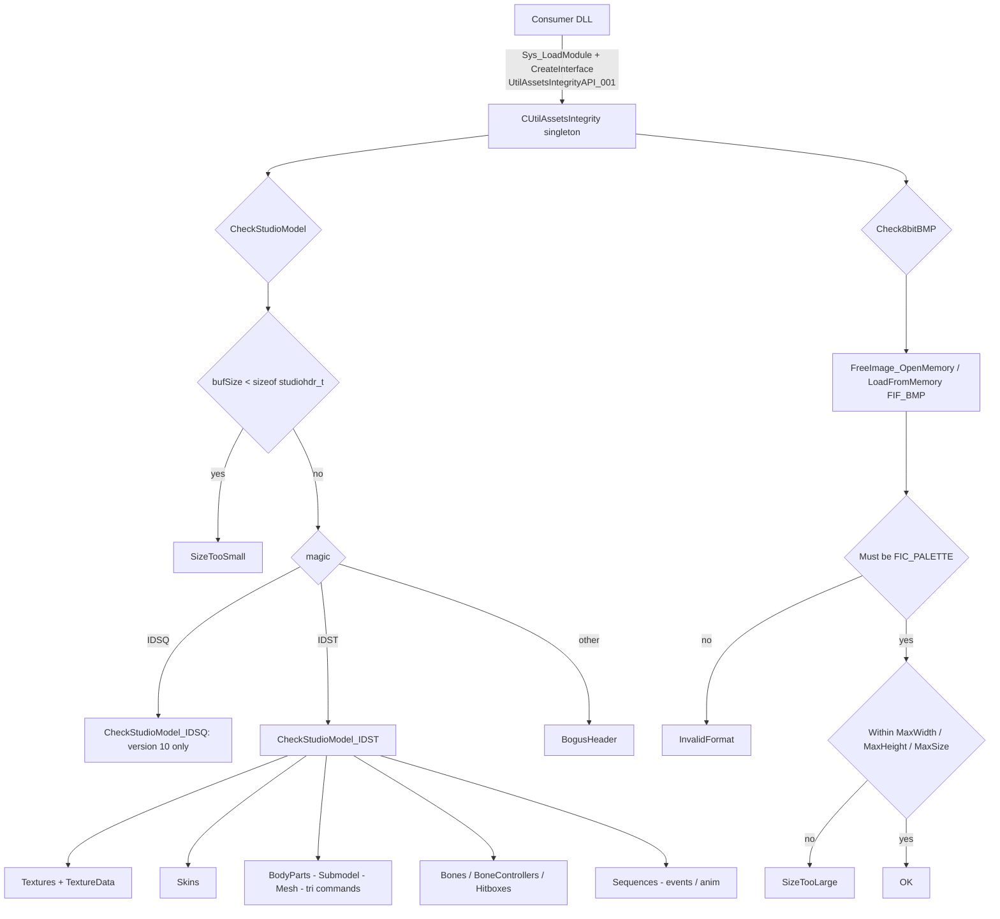

# UtilAssetsIntegrity

UtilAssetsIntegrity is a standalone utility DLL (`UtilAssetsIntegrity.dll`) that performs basic
integrity and bounds validation on untrusted binary assets through the `IUtilAssetsIntegrity`
interface, so malformed data does not cause out-of-bounds reads/writes or crashes in the upper layers
that parse, render or load it. It covers two resource types: GoldSrc/HL1 StudioModel assets
(`IDST` main models and `IDSQ` sequence groups) and 8-bit indexed-color BMP images.

## Provenance

This repository is the standalone UtilAssetsIntegrity library, extracted from MetaHookSv
(`PluginLibs/UtilAssetsIntegrity/`) into its own CMake workspace, aligned with the standalone
Renderer, PrecacheManager and HeapPatch projects. The module note `memory/UtilAssetsIntegrity.md`
was migrated from MetaHookSv `memory/UtilAssetsIntegrity.md` and adapted to the new layout: the
original MSBuild project was replaced by CMake, `src/` holds the module, `include/Interface/` holds
the public header and `tests/SmokeTests.cpp` owns the migration tests. This note is the high-level
index for the repository; the module note carries the per-check analysis and the source-level
boundaries. The `metahooksv` Basic Memory project belongs to the source repository; notes here use
the `utilassetsintegrity` project and the `utilassetsintegrity/` permalink prefix.

## Responsibilities and entry points

- `src/UtilAssetsIntegrity.cpp`: `CUtilAssetsIntegrity : public IUtilAssetsIntegrity` — the whole
  implementation (`CheckStudioModel`, `Check8bitBMP` and the per-block validators), plus the
  singleton registration that `EXPOSE_SINGLE_INTERFACE` publishes at the end of the file.
- `src/dllmain.cpp`: no-op DLL entry point.
- `include/Interface/IUtilAssetsIntegrity.h`: the public contract —
  `UTIL_ASSETS_INTEGRITY_INTERFACE_VERSION` (`"UtilAssetsIntegrityAPI_001"`),
  `UtilAssetsIntegrityCheckReason`
  (`OK/InvalidFormat/SizeTooLarge/SizeTooSmall/BogusHeader/VersionMismatch/OutOfBound/Unknown`),
  `UtilAssetsIntegrityCheckResult` (`ReasonStr[256]`) and
  `UtilAssetsIntegrityCheckResult_BMP` (adds `MaxWidth` / `MaxHeight` / `MaxSize`).
- `tests/SmokeTests.cpp`: a DLL-integration smoke test that loads the real module, obtains its
  factory and exercises the public behavior.

Public workflows:

- `CheckStudioModel(buf, bufSize, out)`: rejects anything smaller than `studiohdr_t` as
  `SizeTooSmall`, then dispatches on the magic — `IDST` to `CheckStudioModel_IDST`, `IDSQ` to
  `CheckStudioModel_IDSQ` (which only requires `version == 10`, else `VersionMismatch`), anything
  else `BogusHeader`. The `IDST` path distinguishes the "system-memory" segment
  (`texturedataindex` when `textureindex != 0`, otherwise `length`) from the whole file
  (`bufSize`), and then validates the texture table and texture pixel data, skins, body parts
  (recursing into submodels, meshes and tri commands), bones, sequences (recursing into events and
  anim data), hitboxes and bone controllers.
- `Check8bitBMP(buf, bufSize, out)`: opens the buffer with FreeImage, requires the `FIC_PALETTE`
  (indexed-color) classification (else `InvalidFormat`), and applies the caller-supplied
  `MaxWidth` / `MaxHeight` / `MaxSize` limits (else `SizeTooLarge`). `MaxSize` is the decoded pixel
  count, not the input file size; all three default to zero, and a null result pointer skips the
  limits entirely.

## Architecture



The checks fail fast: every validator returns a reason as soon as a bound is violated, and the
caller-supplied `ReasonStr` is filled with a readable explanation when a result object is provided.

## Dependencies

- **Public contract**: `include/Interface/IUtilAssetsIntegrity.h` plus the MetaHook SDK's
  `interface.h` for `IBaseInterface` / `CreateInterface`; the SDK's
  `include/HLSDK/common/interface.cpp` is compiled into this DLL (the launcher is never built here).
- **HLSDK / GoldSrc structures**: `studio.h` (`studiohdr_t`, `mstudiomesh_t`, and the rest of the
  model layout) and `engine/studio.h`.
- **FreeImage**: dynamic dependency for BMP decoding, linked as the CMake target `FreeImage` built
  from a separate binary directory; the runtime DLL is installed under
  `svencoop/metahook/dlls/FreeImage/` and must be reachable by the Windows loader before this DLL is
  loaded. Consumers open the module accordingly (the SCModelDownloader plugin is the reference
  integration: `Sys_LoadModule` + `Sys_GetFactory` + `UTIL_ASSETS_INTEGRITY_INTERFACE_VERSION`).
- **ScopeExit**: header-only, used to release FreeImage resources.
- **Build-only inputs, all read-only**: `METAHOOK_SOURCE_PATH` (default pinned commit),
  `FREEIMAGE_SOURCE_PATH` (pinned clone; vendor sources unchanged), `SCOPEEXIT_SOURCE_PATH`
  (pinned), and a SHA-256-verified VC-LTL 5.3.1 package in `thirdparty/cache`.
- **No game integration**: the library uses no engine gamedata and needs no `plugins.lst` entry; it
  is loaded by other modules at runtime.

## Repository layout

- `src/UtilAssetsIntegrity.cpp`, `src/dllmain.cpp` — implementation and DLL entry point.
- `include/Interface/IUtilAssetsIntegrity.h` — public header (installed for consumers).
- `tests/SmokeTests.cpp` — factory, singleton and validation smoke tests (CTest).
- `CMakeLists.txt`, `cmake/Dependencies.cmake`, `cmake/VCLTL.cmake` — build and dependency pinning.
- `scripts/build-UtilAssetsIntegrity-x86-{Debug,Release}.bat` — configure/build/test/install entry
  points.
- `docs/build.md` — build commands, dependency inputs, verification gates and migration records.
- `memory/UtilAssetsIntegrity.md` — the migrated module note (per-check analysis and known
  boundaries); it is also installed next to the DLL.
- `README.md`, `README.zh-CN.md`, `THIRD-PARTY-NOTICES.md`, `licenses/` — documentation and notices.

## Build and data flow

`scripts/build-UtilAssetsIntegrity-x86-{Debug,Release}.bat` → CMake (Visual Studio 17 2022,
`-A Win32`) → compile → CTest → install → repeat the public-interface smoke test against the
installed DLLs. Both configurations use C++20, the static CRT with VC-LTL 5.3.1 (`/MTd` Debug, `/MT`
Release), and Release enables interprocedural optimization. `BUILD_TESTING` defaults to `ON` for the
scripts; a direct CMake build may set it to `OFF`.
Install output is under `install/x86/<Configuration>/`:

```text
svencoop/metahook/dlls/UtilAssetsIntegrity.dll
svencoop/metahook/dlls/UtilAssetsIntegrity.pdb
svencoop/metahook/dlls/FreeImage/FreeImage.dll   (FreeImaged.dll for Debug)
include/Interface/IUtilAssetsIntegrity.h
licenses/                                        (ScopeExit, MetaHook, HLSDK, VC-LTL, FreeImage)
```

Nothing is deployed into a game automatically. GitHub Actions builds and tests x86 Release for main
pushes, pull requests and manual runs; `v*` tags create a release whose archive contains only
`svencoop/` and `include/`.

## Notes

- The migration preserves the original validation behavior and the ABI
  (`UtilAssetsIntegrityAPI_001`, its vtable and the result layouts). It does not expand the original
  guarantees: the module note records the known weak spots — the hitbox table's `pbbox_end` is
  computed but not range-checked, `CheckStudioModel_BoneControllers` bounds the controller table by
  `numbones` instead of `numbonecontrollers`, `CheckStudioModel_Bone` bounds
  `bonecontroller[j]` by `numbones`, several checks compare `> buf + bufSize` rather than `>=` or
  ignore the element size, `CheckStudioModel_TextureData` has no overflow guard for
  `palsize = width * height`, and the anim path uses `(panimvalue + 255)` as a heuristic upper
  bound.
- The returned interface is a DLL-owned singleton: keep the DLL loaded while using it and do not
  delete the instance.
- `Check8bitBMP` decides on FreeImage's classification, so it validates "is this an indexed-color
  BMP that fits the limits", not the pixel data itself; the size limits only exist when the caller
  supplies them.
- The smoke test exercises the real DLL factory rather than including the implementation, so it
  verifies the shipping artifact: factory versioning, singleton behavior, model
  format/version/bounds failures, BMP decoding, indexed-color rejection, limits and the
  optional-result-pointer path.
- `docs/build.md` records the initial migration verification (both configurations exit 0, CTest 1/1,
  installed-DLL smoke tests, x86 `CreateInterface` export and import checks, byte-for-byte equality
  of the migrated implementation/interface/license with the originals, and the packaging scope).
  Those records are historical: no GitHub-hosted workflow or in-game integration ran locally.

## Callers (optional)

- Plugins and tools load the DLL at runtime, resolve `CreateInterface` and request
  `UtilAssetsIntegrityAPI_001`; the reference integration is SCModelDownloader's
  `UtilAssetsIntegrity.cpp`, which sets the BMP limits and calls `Check8bitBMP` before writing a
  downloaded asset and `CheckStudioModel` before persisting a model.
- Batch tooling over asset packages uses the same interface.

## External documentation

`README.md` is the English landing page and `README.zh-CN.md` the Chinese one; `docs/build.md`
documents the build inputs, verification gates and packaging, and `THIRD-PARTY-NOTICES.md` plus
`licenses/` carry the dependency terms. The per-check analysis lives in
`memory/UtilAssetsIntegrity.md`.
